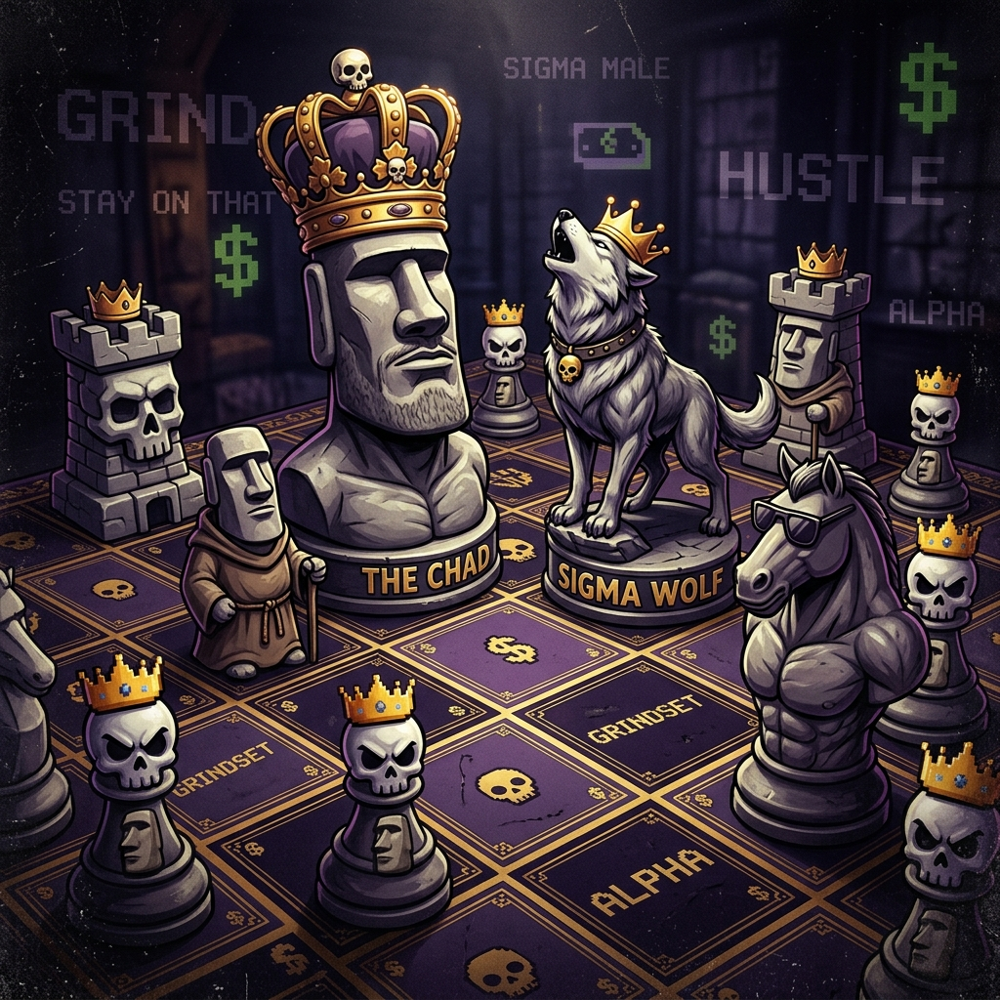

# ♟️ MemeChess — The Ultimate Brainrot Chess Experience

<div align="center">



**Play chess. Earn MemeCoins. Collect viral skins. Flex your ELO.**

[](https://memechess.vercel.app)
[](https://nextjs.org)
[](https://prisma.io)
[](https://vercel.com)

</div>

---

## 🎮 What is MemeChess?

MemeChess is a **full-stack competitive chess platform** built for the brainrot generation. It combines classic chess strategy with internet meme culture — complete with emoji piece skins, sigma AI opponents, ELO ratings, MemeCoins economy, and a leaderboard to prove who the real Gigachad Grandmaster is.

---

## ✨ Features

### 🧠 Intelligent AI Opponents
- **Beginner** — Plays random moves. Perfect for learning.
- **Intermediate** — Prioritizes captures using one-ply evaluation.
- **Hard** — Full **Minimax algorithm** with material-based board evaluation. Actually challenging.

### 👑 ELO Rating System
- Dynamic ELO calculated using the **official chess rating formula**
- Beat harder AI → gain more ELO
- Lose → lose ELO (cope)
- Persistent across sessions via cloud database

### 🪙 MemeCoins Economy
- Earn coins by winning games
- More coins for harder difficulty wins
- Spend coins in the **MemeShop** on exclusive skin and audio packs

### 🎨 Skin Packs
| Pack | White Pieces | Black Pieces |
|------|-------------|--------------|
| **Classic** | ♙♘♗♖♕♔ | ♟♞♝♜♛♚ |
| **Crypto** | 🪙🐕💎🚀📈🧑‍🚀 | 💸🐻🤡🏢📉👴 |
| **Sigma** | 🍷🗿🏋️🏰👑😎 | 💀🤓🍼🏚️💸😭 |

### 🎵 Audio Packs
- **Classic** — Crisp wood clicks and satisfying pops
- **Brainrot** — Cartoon cowbells and energetic splats
- **Phonk** — Heavy bass hits and laser guns

### 🏆 Dual Leaderboard
- **Top ELO Kings 👑** — Compete against legendary bots like `StockBot_Sigma` (2850 ELO)
- **Coin Billionaires 💰** — Who's the richest on the arena?

### ⏱️ Standard Chess Features
- Chess clocks (10 minutes per side)
- Captured pieces display
- Move history log (algebraic notation)
- Drag & drop + click-to-move piece control
- Auto-promotion to Queen

### 🛡️ Admin Panel
- Password-protected admin dashboard at `/admin`
- View all registered players with full stats
- Delete any user account
- Bots are protected from deletion

---

## 🛠️ Tech Stack

| Layer | Technology |
|-------|-----------|
| **Frontend** | Next.js 15 (App Router), React |
| **Styling** | Vanilla CSS + inline styles, Glassmorphism design |
| **Chess Engine** | [chess.js](https://github.com/jhlywa/chess.js) |
| **Sound** | [Howler.js](https://howlerjs.com/) |
| **Database ORM** | [Prisma](https://prisma.io) |
| **Database** | PostgreSQL (Neon Serverless) |
| **Icons** | [Lucide React](https://lucide.dev) |
| **Hosting** | [Vercel](https://vercel.com) |
| **BGM** | SoundHelix royalty-free tracks |

---

## 🚀 Getting Started (Local Development)

### Prerequisites
- Node.js 18+
- A [Neon](https://neon.tech) or any PostgreSQL database

### Installation

```bash
# 1. Clone the repo
git clone https://github.com/willutoi/memechess.git
cd memechess

# 2. Install dependencies
npm install

# 3. Set up environment variables
cp .env.example .env
# Edit .env and add your DATABASE_URL

# 4. Push database schema
npx prisma db push

# 5. Run the dev server
npm run dev
```

Open [http://localhost:3000](http://localhost:3000) and start playing!

---

## ⚙️ Environment Variables

| Variable | Description |
|----------|-------------|
| `DATABASE_URL` | PostgreSQL connection string (e.g. from Neon) |
| `ADMIN_PASSWORD` | Secret password for the `/admin` panel |

---

## 📁 Project Structure

```
memechess/
├── prisma/
│   └── schema.prisma          # Database schema (User, ShopItem)
├── public/
│   ├── skin_classic.png       # Skin pack preview images
│   ├── skin_crypto.png
│   └── skin_sigma.png
├── src/
│   ├── app/
│   │   ├── api/
│   │   │   ├── auth/          # Login / register endpoint
│   │   │   ├── user/          # User data endpoint
│   │   │   ├── game-result/   # ELO & coin update after match
│   │   │   ├── leaderboard/   # Dual leaderboard endpoint
│   │   │   ├── shop/buy/      # Purchase skin/audio packs
│   │   │   └── admin/         # Admin user management
│   │   ├── admin/             # Admin panel UI
│   │   ├── leaderboard/       # Leaderboard page
│   │   ├── play/              # Game page
│   │   ├── shop/              # Shop page
│   │   └── page.js            # Home / login page
│   ├── components/
│   │   ├── MemeChessBoard.js  # Core chess board component
│   │   └── BGMPlayer.js       # Background music player
│   └── lib/
│       └── db.js              # Prisma client singleton
```

---

## 🤖 AI Architecture

The chess AI uses a **Minimax algorithm** with static board evaluation:

```
Piece Values:
  Pawn   = 10  |  Knight = 30  |  Bishop = 30
  Rook   = 50  |  Queen  = 90  |  King   = 9000
```

- **Beginner**: Random move selection (depth 0)
- **Intermediate**: One-ply capture priority evaluation
- **Hard**: Minimax with 2-ply lookahead (depth 2), minimizing opponent's material

---

## 📜 License

MIT — do whatever you want, just don't pretend you made it from scratch 💀

---

<div align="center">

Made with 🍷 and 🗿 by inst: **@willutoi**

*«14,000,605 futures. You lose in ALL of them.»*

</div>
